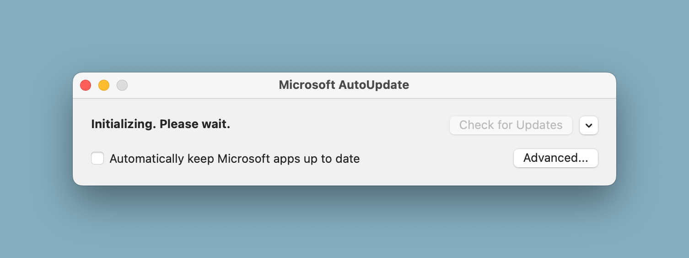

# Microsoft Update Remover

This project provides a Zsh script to remove Microsoft AutoUpdate components from macOS. It lists the components, asks for user confirmation, and deletes them if confirmed.

## Features

- Lists Microsoft AutoUpdate components
- Asks for user confirmation before deletion
- Deletes specified components

## Usage

Clone the repository and Run the script with root privileges:

   ```bash
   sudo ./remove_ms_update.sh
   ```

## Microsoft AutoUpdate Window




## Components Removed

- `/Library/Application Support/Microsoft/MAU2.0/Microsoft AutoUpdate.app`
- `/Library/LaunchAgents/com.microsoft.update.agent.plist`
- `/Library/LaunchDaemons/com.microsoft.autoupdate.helper.plist`
- `/Library/PrivilegedHelperTools/com.microsoft.autoupdate.helper`

## License

This project is licensed under a free-to-use license. You are free to use, modify, and distribute this script. However, the authors are not responsible for any misuse or damage caused by this script. Use it at your own risk.

Please note that by removing Microsoft AutoUpdate, you may not receive future updates for Microsoft Office products. The authors are not liable for any issues arising from the lack of updates.

## References

This script was created with reference to the guide on [OS X Daily](https://osxdaily.com/2019/07/20/how-delete-microsoft-autoupdate-mac/).

## Note

If you want to update Microsoft Office in the future, you can manually download updates from Microsoft's website:
[Microsoft Office Updates](https://learn.microsoft.com/en-us/officeupdates/update-history-office-for-mac)
