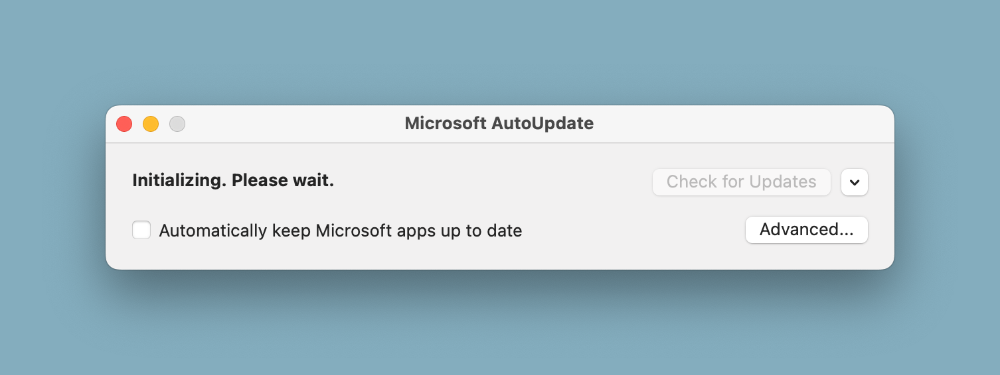

# Microsoft Update Remover

A small zsh script that removes Microsoft AutoUpdate from macOS after showing you what it found and asking for confirmation.

## Why

Microsoft Office for Mac installs Microsoft AutoUpdate (MAU), which runs in the background and opens its own window to check for updates:



If you would rather update Office by hand, this script removes the MAU app and its launch agent, launch daemon and privileged helper in one step.

## Quick start

```bash
git clone https://github.com/mrsarac/microsoft-update-remover.git
cd microsoft-update-remover
sudo ./remove_ms_update.sh
```

The script needs root. Without `sudo` it stops with a message and changes nothing.

## How it works

1. Asks whether to check for Microsoft AutoUpdate components (`y` to continue).
2. Prints a table of the four paths below with `[Exists]` or `[Not Found]` and their size.
3. Asks again before deleting anything (`y` to continue).
4. Runs `rm -rf` on each path and prints `REMOVED` or `ERROR` per line.

Paths removed:

- `/Library/Application Support/Microsoft/MAU2.0/Microsoft AutoUpdate.app`
- `/Library/LaunchAgents/com.microsoft.update.agent.plist`
- `/Library/LaunchDaemons/com.microsoft.autoupdate.helper.plist`
- `/Library/PrivilegedHelperTools/com.microsoft.autoupdate.helper`

Answering anything other than `y` (or `e`) at either prompt cancels without changes.

## Status / limits

- A single script written in December 2024; no tests and no releases.
- It does not unload the launch agent or daemon first; MAU processes that are already running may keep running until you log out or restart.
- It only knows the four paths above. Other Microsoft files (Office apps, caches, preferences) are not touched.
- Without MAU you will not get automatic Office updates. An Office installer or update may put MAU back.
- To update Office manually, download updates from Microsoft: [Office for Mac update history](https://learn.microsoft.com/en-us/officeupdates/update-history-office-for-mac).

The script is based on the steps in this [OS X Daily guide](https://osxdaily.com/2019/07/20/how-delete-microsoft-autoupdate-mac/).

## License

MIT. See [LICENSE](LICENSE).
